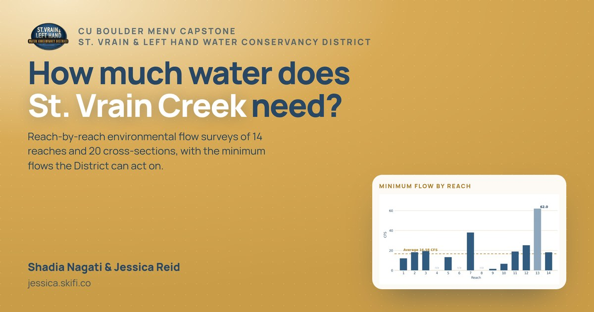

# Environmental Flow Surveys · St. Vrain Creek

Landing page for the reach-by-reach environmental flow survey of St. Vrain Creek - a CU Boulder
MENV capstone by **Shadia Nagati & Jessica Reid** with the **St. Vrain & Left Hand Water
Conservancy District**. It's the destination behind the QR code on the conference poster.

**Live:** https://jessica.skifi.co · **Mirror:** https://svlh-flow-surveys.vercel.app



---

## What's on the page

| Section | Contents |
|---|---|
| Hero | Headline, project framing, key numbers (14 target reaches / 13 surveyed / ~16 CFS / 2-of-3 criteria) and the minimum-flow-by-reach chart |
| `01` Storymap | Background (32-mile Lyons-Longmont study area, 2013 flood, SMP), reach map (click to open full size), watershed figure, ArcGIS storymap placeholder, and a "How we measured it" method note |
| `02` Acknowledgements | Thanks text (incl. CWCB / WRA modeling support) plus credit cards for Scott Griebling, Meghan McCarroll and the SMP Flow Advisory Working Group |
| `03` Data | Three download cards - currently "Coming soon" |
| `04` Reports | Minimum Environmental Flow Report (live link) + Policy Brief and stakeholder whitepaper cards |
| `05` References | Full 25-entry works-cited list |
| `06` Gallery | Ten field photos with a keyboard-navigable lightbox |

## Stack

Plain HTML, CSS and vanilla JS. **No build step, no dependencies, no framework.** Deploys as
static files. Manrope is loaded from Google Fonts; everything else is local.

```
index.html          all page content
styles.css          design tokens (top of file) → components → motion layer
main.js             gallery + lightbox, mobile menu, scroll spy, reveals, count-up, parallax
assets/             optimized WebP images, logos, icons, OG image
favicon.svg/.ico    site icons
site.webmanifest    PWA manifest
robots.txt          + sitemap.xml
```

## Brand

Taken from the District's scientific poster, defined as CSS custom properties at the top of
`styles.css`:

| Token | Value | Use |
|---|---|---|
| `--gold-500` | `#D8AA55` | Hero background, accents |
| `--gold-700` | `#A97C25` | Eyebrows, small emphasis |
| `--cream` / `--cream-2` | `#F7EEDD` / `#FBF6EC` | Section and page backgrounds |
| `--blue-700` | `#274765` | Headings, primary UI |
| `--blue-500` | `#315B80` | Links, secondary fills |
| `--ink-soft` | `#4A6C8C` | Body copy |

Typeface: **Manrope** (400/500/700/800).

## Editing

**Add the storymap link** - in `index.html`, find `#storymap` and replace the
`<span class="chip chip--wait">Link coming soon</span>` with an anchor:

```html
<a class="chip chip--live" href="ARCGIS_URL" target="_blank" rel="noopener">Open the storymap</a>
```

**Publish a data or report file** - drop the file in `assets/`, then turn the matching
`card--wait` into a `card--link`, copying the pattern of the E-Flow Recommendations card in
`#reports`.

**Change gallery photos** - images live in `assets/` as `gal-<name>.webp` (full size) and
`gal-<name>-sm.webp` (thumbnail). The list, alt text and captions are the `PHOTOS` array at the
top of `main.js`.

**Update the OG preview image** - replace `assets/og-image.jpg` (1200×630).

## Motion

Entrance and scroll animation is CSS transitions driven by `IntersectionObserver`; the parallax
and progress bar run in a single rAF-throttled scroll handler. Everything is disabled under
`prefers-reduced-motion: reduce`, and reveals have a 3.5s failsafe so content can never be left
hidden.

## Accessibility

Skip link, visible focus rings, 44px minimum touch targets, labelled icon-only buttons,
descriptive `alt` on every meaningful image, keyboard-operable lightbox (Escape / arrows), and
AA-contrast text pairs throughout.

## Deploying

The repo is connected to Vercel: **any push to `main` deploys automatically.** No build command
and no output directory; Vercel serves the root as static files.

To point a new domain at it: add the domain in Vercel → Project → Settings → Domains, then add a
`CNAME` at the registrar pointing the subdomain to the value Vercel shows. `jessica.skifi.co` uses
a CNAME to `eb3086e5438b2eaa.vercel-dns-017.com` in GoDaddy.

## Still to come

- ArcGIS storymap URL
- Real data files (spreadsheets / PDFs) for `03 Data`
- Policy Brief and stakeholder whitepaper for `04 Reports`
- Final photo selection for the gallery
